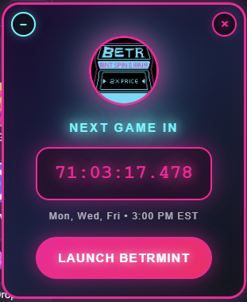

# BETRMINT Countdown - Onchain Creator Game

A Chrome extension that displays a countdown timer for the next BETRMINT game round, helping users never miss a chance to win up to 100X in Based tokens!

**Latest Version: 1.1.0** - Now starts minimized by default for a cleaner browsing experience!

---

## 🖼️ Screenshot

<p align="center">
  
</p>

---

## Features

- 🎮 **Game Countdown**: Shows time until next BETRMINT round with precision timing
- 📅 **Smart Scheduling**: Automatically calculates next game based on Mon/Wed/Fri at 3:00 PM EST schedule
- 🎯 **Auto-Injection**: Appears on every webpage you visit
- 🎨 **Beautiful Design**: Modern gradient UI with neon glow effects
- 🔧 **Interactive Controls**: Minimize and close functionality
- 📱 **Responsive**: Works on desktop and mobile browsers
- ⚡ **Real-time Updates**: Live countdown with smooth animations
- 🎛️ **Popup Controls**: Manage countdown from browser toolbar
- 🚀 **Direct Launch**: One-click access to BETRMINT game
- ✨ **Default Minimized**: Starts as a small, unobtrusive spinning icon (New in v1.1.0)
- 🎪 **Compact Design**: Smaller minimized container (50px) for better screen space usage

## What's New in v1.1.0

### 🎯 Improved User Experience
- **Default minimized state**: Extension now starts as a small, unobtrusive circular icon
- **Smaller minimized container**: Reduced from 80px to 50px for less screen space usage
- **Perfect circular shape**: Fixed oval distortion issue in minimized mode
- **Optimized spinning logo**: Properly sized to fit perfectly in the smaller container

### 🔧 Technical Improvements
- Updated glow effects to match smaller dimensions
- Improved responsive design for minimized state
- Better visual proportions and spacing

## What is BETRMINT?

BETRMINT turns supporting onchain creators into a game of serendipitous speculation. Collect content, get FREE TICKETS, and spin the neon flywheel to win up to 100X in Based tokens!

**Prize Pool**: $1500 per round  
**Schedule**: Monday, Wednesday, Friday at 3:00 PM EST  
**Platform**: Farcaster Mini App

## Installation

1. **Download the Extension**
   - Download or clone this repository to your computer

2. **Open Chrome Extensions Page**
   - Open Google Chrome
   - Navigate to `chrome://extensions/`
   - Or go to Chrome menu > More Tools > Extensions

3. **Enable Developer Mode**
   - Toggle the "Developer mode" switch in the top-right corner

4. **Load the Extension**
   - Click "Load unpacked" button
   - Select the folder containing the extension files
   - The extension should now appear in your extensions list

5. **Pin the Extension (Optional)**
   - Click the puzzle piece icon in the Chrome toolbar
   - Find "BETRMINT Countdown" and click the pin icon

## Usage

### Automatic Countdown
- The countdown timer automatically appears on any webpage you visit as a **small spinning icon** in the top-right corner
- **Click the spinning icon** to expand and see the full countdown timer
- Displays time remaining until the next scheduled game round
- Automatically adjusts for EST/EDT timezone changes

### Interactive Controls
- **Expand**: Click the spinning logo to expand to full countdown view
- **Minimize**: Click the "−" button to minimize back to spinning logo
- **Close**: Click the "×" button to remove the countdown completely
- **Launch Game**: Click "Launch BETRMINT" to open the game directly

### Popup Controls
Click the extension icon in the toolbar to access:
- **Show Countdown**: Make the countdown visible if hidden
- **Hide Countdown**: Hide the countdown from the page
- **Refresh Timer**: Recalculate the next game time

## Game Schedule

- **Days**: Monday, Wednesday, Friday
- **Time**: 3:00 PM EST (automatically adjusts for Daylight Saving Time)
- **Prize Pool**: $1500 per round
- **Platform**: Farcaster Mini App

*Note: Rounds go fast! Keep the countdown visible to never miss a drop.*

## User Experience

### Default Behavior (v1.1.0+)
- Extension starts as a **small 50px circular icon** with a spinning logo
- **Unobtrusive**: Takes minimal screen space while browsing
- **Easy access**: Click the spinning icon anytime to see the full countdown
- **Smooth animations**: Seamless transitions between minimized and expanded states

### Visual Design
- **Neon glow effects**: Cyberpunk-inspired visual style
- **Gradient backgrounds**: Beautiful color transitions
- **Responsive animations**: Smooth hover effects and transitions
- **Perfect circles**: No distortion in minimized mode

## Customization

You can customize the extension by modifying these files:

- **`config.json`**: Change game schedule and display settings
- **`content.js`**: Modify countdown behavior and functionality
- **`styles.css`**: Customize appearance and animations
- **`manifest.json`**: Update extension metadata and permissions

### Changing the Game Schedule

To modify the schedule, edit `config.json`:

```json
{
  "schedule": {
    "timezone": "America/New_York",
    "days": [1, 3, 5],
    "time": { "hour": 15, "minute": 0, "second": 0 }
  },
  "display": {
    "title": "NEXT GAME IN",
    "timezone_display": "EST"
  }
}
```

## Changelog

### v1.1.0 (Latest)
- ✨ Default minimized state for better user experience
- 🎯 Smaller minimized container (50px) for less screen space usage
- 🔧 Fixed oval distortion in minimized mode
- 📐 Optimized spinning logo sizing (36px)
- 🎨 Updated glow effects for smaller dimensions

### v1.0.0
- 🎉 Initial release
- ⏰ Countdown timer functionality
- 🎮 BETRMINT game integration
- 🎨 Neon UI design
- 🔧 Minimize/expand controls

## Technical Details

- **Manifest Version**: 3
- **Permissions**: activeTab, scripting
- **Supported Browsers**: Chrome, Edge, and other Chromium-based browsers
- **Platform**: Cross-platform (Windows, macOS, Linux)

## Support

For issues, feature requests, or questions:
- Create an issue on this repository
- The extension automatically handles timezone changes and schedule calculations
- All game times are displayed in EST/EDT

---

**Never miss a BETRMINT round again!** 🎮✨
